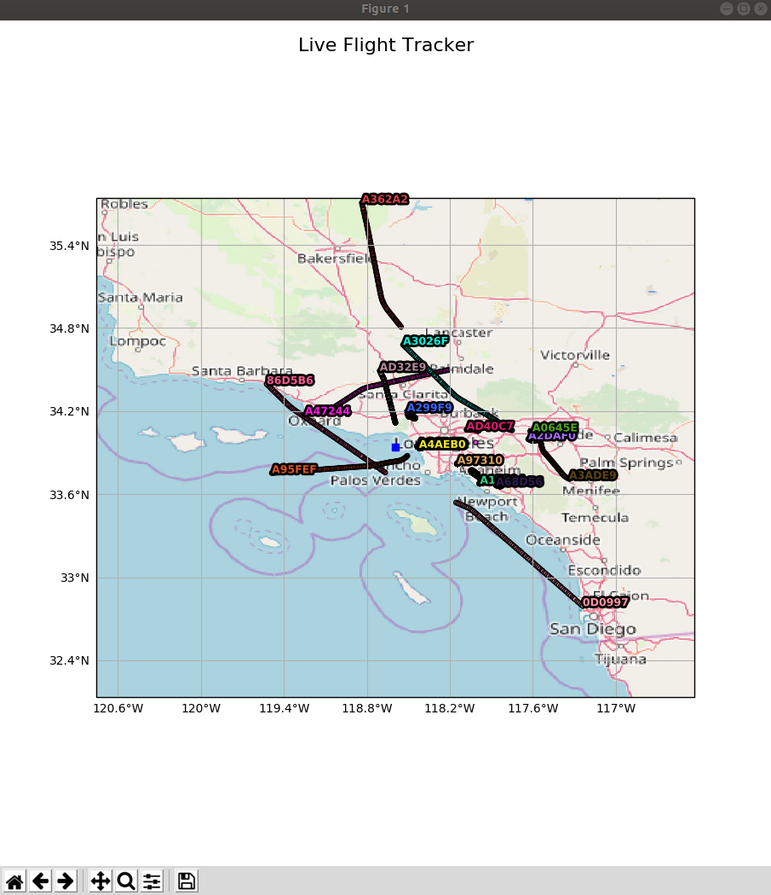

# Real-Time Flight Radar

Live flight tracking terminal app written in Python. All you need to provide is a point from which you want to observe.  Relax and observe planes above your head!



## Getting Started

These instructions will get you a copy of the project up and running on your local machine.

### Prerequisites
You need to install python packages listed in requirements.txt

```
Cartopy
geopy
requests
matplotlib
and few others
```
### Installing

A step by step series of examples that tell you how to get a development env running

Clone the repository.

```
git clone https://github.com/QuarKUS7/pydar.git
```
Install prerequisites

```
cd pydar
pip install -r ./requirements.txt
```
That's it!

## How to use Pydar
For observation of a point you needs it's gps coordinates.

Than just run pydar.py with arguments **latitude** **longitude** of the point and enjoy!

For example, observation of Vaclav Havel Airport in Prague:
```
python pydar.py 50.100499598 14.255998976
```
For John F. Kennedy International Airport (JFK)
```
python pydar.py 40.6413111 -73.7781391
```
Another optional parameter is distance parameter. This parameter sets how far to observe from the point. Default value is 150 km.
```
python pydar.py 40.6413111, -73.7781391 -d 150
```
## How to use without installation
If you just want to try the app and you don't want to install all the necessaties, then it is possible to use Docker.
Just build the image in Linux.
```
docker build -t pydar .
xhost +
```
and run
```
docker run -ti --rm -e DISPLAY=$DISPLAY -v /tmp/.X11-unix:/tmp/.X11-unix pydar **latitude** **longitude**
```
For example Vaclav Havel Airport in Prague
```
docker run -ti --rm -e DISPLAY=$DISPLAY -v /tmp/.X11-unix:/tmp/.X11-unix pydar 50.100499598 14.255998976
```
## Authors

* **Peter Pagac** - (pagac.peter123@gmail.com)

## License

This project is licensed under the MIT License - see the [LICENSE.md](LICENSE.md) file for details

## Acknowledgments

* Thank you ADS-B Exchnage for data about flights!
https://www.adsbexchange.com/
